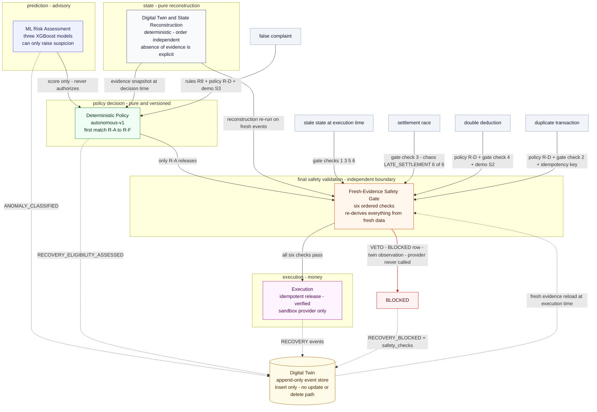

# The Distinctive Innovation — Enforced Separation of Prediction and Execution

**Generated:** 2026-10-07 · **Data context:** 100% synthetic (seed 42), sandbox provider only, no real money
**Verification basis:** every architecture claim below was checked against the cited source files on 2026-10-07; every figure is quoted from `reports/business_impact/business_impact_report.md` and `reports/stage11_chaos_testing.md`

---

## 1. Executive summary

APRS's distinctive contribution is not any single technique but the **enforced separation between prediction and execution**. An ML risk assessment identifies recovery risk; a deterministic, versioned policy establishes eligibility; a pure reconstruction engine rebuilds auditable state from the event record; and a **fresh-evidence safety gate — independent of the decision that sent the request — revalidates the entire state immediately before recovery execution**, inside the executor, on data reloaded at execution time. A pure, independent gate stands between an eligible-looking decision and the money; an append-only Digital Twin stands behind both, making every decision and every veto replayable. ML advises, rules decide, the gate vetoes, the twin remembers.

**The verified claim:** ML risk assessment identifies recovery risk, deterministic policy establishes eligibility, the Digital Twin reconstructs auditable state, and a fresh-evidence safety gate independently revalidates the state immediately before recovery execution. This prevents stale or invalid recovery decisions from directly causing financial execution and makes recovery replayable and auditable. *Verified against the implementation: the gate is not a recommendation layer — it runs inside the only module that can call the payment provider (`api/services/recovery_executor.py:188-215`, `:311-347`), and no code path reaches the provider without passing it.*

---

## 2. Why each layer alone is insufficient

The contribution is the composition. Each component, used alone, fails in a specific, predictable way:

- **ML alone** — three XGBoost models (`api/services/ml_service.py:96-151`) produce a score, not an evidentiary grounding. On 100% synthetic data the models are uncalibrated against real payment populations; nothing ties a score to observed facts; and a score computed at assessment time is stale by execution time. An ML-only auto-recovery would release funds on stale confidence and have no record of *why*.
- **Deterministic policy alone** — the policy (`api/services/recovery_decision_policy.py:98-252`) is pure and correct, but it decides on a **snapshot**. The window between decision and execution is exactly where a late settlement confirmation can land; a rules engine that cannot re-check the world at execution time will act on an obsolete view.
- **Digital Twin alone** — the twin (`api/services/digital_twin.py:21-48`) remembers everything and acts on nothing. It cannot veto a bad decision, and a perfect audit log of a preventable loss is still a loss.
- **Fresh gate alone** — a stateless check has no memory. It blocks today's bad release and then forgets; there is no timeline to replay, no way to answer "what did the system know, and when did it know it?"

Composed, each layer covers the next one's blind spot: the twin supplies evidence, the policy consumes it under pinned precedence, the gate re-derives it fresh at the moment of money movement, and every step — including every veto — lands in the same append-only timeline as the state change itself (`api/services/digital_twin.py:4-9`).

---

## 3. The five-stage data flow, end to end

One call, `process_transaction` (`api/services/autonomous_recovery.py:101-252`), runs the full pipeline with no commit inside — the route layer commits once (`api/services/autonomous_recovery.py:110-112`), so state changes and their twin records land atomically:

1. **Ingest** — payment events enter through the real ingestion service with duplicate rejection (chaos `DUPLICATE_EVENT`: second ingest of the same batch records `created=0, duplicates=N`, never re-inserts — `reports/stage11_chaos_testing.md` scenario 5).
2. **Assess** — `risk_engine.run_assessment` (`api/services/risk_engine.py:327-396`) applies the pinned hybrid precedence: (1) deterministic rules always win `anomaly_type` (`:8-10`); (2) ML can only **raise** suspicion — upgrade to SUSPICIOUS requires score >= 0.7 *and* a behaviorally suspicious predicted scenario (`:86`, `:95-97`, `:255-284`); (3) the blended `risk_score` may raise `risk_level` one step at >= 0.75, never lower it (`:99`, `:290-304`); (4) ML unavailable degrades to rules-only, still functional (`:28-30`). The assessment is reused idempotently by evidence fingerprint (`:144-178`, `:367-373`) and persisted without committing (`:405-433`). The leakage rule holds by construction: `risk_score`/`safe_to_release` are never model inputs (`api/services/ml_service.py:14-16`).
3. **Reconstruct** — `reconstruct_from_events` (`api/services/event_reconstruction.py:1-32`) is a pure function: no LLM, no randomness, no invented events; absence of evidence is explicit (`NOT_OBSERVED`); uncertainty resolves to `INCOMPLETE`, never to a fabricated failure (`:20-23`). Order-independent (chaos `OUT_OF_ORDER_EVENT`).
4. **Decide** — `decide` (`api/services/recovery_decision_policy.py:126-287`) is pure, versioned (`POLICY_VERSION = "autonomous-v1"`, `:95`), first-match over R-A..R-F + DEFAULT (`:10-55` docstring). Only R-A releases: GENUINE_FAILURE + LOW/MEDIUM risk + debit CONFIRMED + settlement NOT_OBSERVED/NOT_CONFIRMED/FAILED, within the hard autonomy caps (amount and previous-failures limits, `:165-192`). Every non-eligible path returns an explicit `BLOCK_*` code (`:194-287`). When uncertain: DO NOT RECOVER (`:8`).
5. **Execute** — only a `RELEASE_LIMIT` decision reaches `execute_recovery` (`api/services/autonomous_recovery.py:164-167`), which runs, in order (`api/services/recovery_executor.py`):
   - idempotency: key = sha256(transaction_id, action, policy_version, evidence_fingerprint), UNIQUE at the DB level (`:99-111`, `:276-291`); same evidence replays with **no provider call and no new row** (`:264-274`); a FAILED row may retry only up to `EXECUTOR_MAX_ATTEMPTS` (`:88`, `:245-263`); a concurrent INSERT race loser adopts the committed winner's row (`:292-308`);
   - **the fresh-evidence safety gate (`:188-215`, run at `:310-313`)**: re-reads the events from the DB, **rebuilds the reconstruction**, and takes the latest stored assessment — nothing trusted from decision time;
   - on block (`:311-347`): row -> STATUS_BLOCKED with `blocked_reason`, the full gate check list stored in `verification_result`, a `RECOVERY_BLOCKED` observation appended to the twin with `safety_checks` metadata, `METRICS_SAFETY_GATE_BLOCKS_TOTAL` incremented — and **the provider call is never reached**;
   - on pass: a lifecycle pre-check re-validates the transition to `LIMIT_RELEASED` before any money moves (`:378-405`), then provider release (`:408-420`), then verification against fresh events and the provider ledger — `LIMIT_RELEASED` is never recorded without it (`:479-504`).

The twin is appended at every stage: `ANOMALY_CLASSIFIED` (`api/services/risk_engine.py:436-493`), `RECOVERY_ELIGIBILITY_ASSESSED` (`api/services/autonomous_recovery.py:217-235`), and the executor's observation vocabulary `RECOVERY_APPROVED / STARTED / EXECUTED / VERIFIED / FAILED / BLOCKED` (`api/services/recovery_executor.py:90-96`, `:122-141`) — each in the same DB transaction as the state change it records. The evaluate path runs the same gate read-only so the evaluate API "must never promise what the gate would refuse" (`api/services/autonomous_recovery.py:342-399`, gate at `:361-380`).

Section 4 renders this path.

---

## 4. Mermaid architecture diagram



Reading the diagram: solid arrows are the decision-to-money path; dotted arrows are twin writes (every stage) and the gate's fresh-evidence reload; the red edge is the veto — it produces a BLOCKED row, a `RECOVERY_BLOCKED` twin observation, and no provider call. The twin is a store beneath the flow: written by every stage, read to re-derive state at execution time. Threat nodes mark where each failure mode is stopped; the exact code locations are in section 5.

---

## 5. Threat/failure-mode table

| Failure mode | Where blocked (file:line) | Blocking code/invariant | Evidence |
|---|---|---|---|
| Settlement race after assessment | `api/services/recovery_safety.py:111-123`; re-derived at `api/services/recovery_executor.py:188-215` | Gate check (3): fresh settlement CONFIRMED -> `BLOCK_NEW_SUCCESSFUL_SETTLEMENT`; the executor reloads events and rebuilds the reconstruction at execution time | Chaos `LATE_SETTLEMENT` 6/6 invariants (`api/services/chaos.py:536-563`); demo S5 (`tests/test_demo_router.py:161`); 2 settlement-race cases in the 149 prevented |
| Double deduction | `api/services/recovery_decision_policy.py:222-258` (R-D); `api/services/recovery_safety.py:125-141` | Rules R1 classifies DOUBLE_DEDUCTION; policy R-D blocks with `BLOCK_DOUBLE_DEDUCTION`; gate check (4) fails on >= 2 distinct debit confirmations in the FRESH event stream | Demo S2 (`tests/test_autonomous_api.py:140`); 57 double deductions inside the 149 prevented, 0 released |
| Duplicate transaction / duplicate processing | `api/services/recovery_decision_policy.py:222-258` (R-D); `api/services/recovery_safety.py:96-109`; `api/services/recovery_executor.py:99-119`, `:276-308` | Rules R2; policy R-D `BLOCK_NOT_ELIGIBLE`; gate check (2) blocks in-flight/done rows; idempotency key UNIQUE at DB level — same evidence replays with no provider call | Chaos `DUPLICATE_EVENT`: second ingest `created=0`; replay tests (`tests/test_autonomous_api.py:220`, demo S6); 24 duplicates in the 149 prevented |
| Stale decision vs changed state | `api/services/recovery_safety.py:2-16` (contract), `:82-176` (checks); `api/services/recovery_executor.py:188-215` (fresh reload) | The gate is INDEPENDENT of the policy: it never trusts the assessment, the decision, or the reconstruction the decision was based on — it re-derives everything from data passed in fresh | `tests/test_recovery_safety.py:108` `test_new_event_rechecked_before_execution`; 38 gate vetoes in live re-simulation (Tier B) |
| Already recovered / in-flight recovery | `api/services/recovery_safety.py:82-109` | Checks (1)+(2): state LIMIT_RELEASED or a recovery row in COMPLETED/VERIFIED/EXECUTING/PENDING/VERIFICATION_PENDING -> `BLOCK_ALREADY_RECOVERED` | Executor replay path returns the existing row without a provider call (`api/services/recovery_executor.py:264-274`) |
| False complaint | `api/services/anomaly_rules.py:464-478` (R8); `api/services/recovery_decision_policy.py:240-258` (R-D) | R8 fires only on BOTH the full success chain AND the explicit customer-reported-failure flag — never inferred from success alone; policy R-D -> NO_ACTION, `BLOCK_NOT_ELIGIBLE` | Demo S3 (`tests/test_autonomous_api.py:160`); 10 false complaints in the 149 prevented |
| Insufficient evidence | `api/services/recovery_decision_policy.py:260-270` (R-E); `api/services/recovery_safety.py:143-167`; `api/services/event_reconstruction.py:20-23` | "Uncertainty never recovers": R-E -> `BLOCK_INSUFFICIENT_EVIDENCE`; gate check (5) requires a root cause and an active recovery-candidate assessment; reconstruction never fabricates a verdict | Gate unit test `tests/test_recovery_safety.py:169`; INCOMPLETE cases route to NO_ACTION |
| Concurrent recovery race | `api/services/recovery_executor.py:276-308`; `:114-119` | UNIQUE(idempotency_key): the IntegrityError loser rolls back and adopts the committed winner's row — one release, one provider reference | Chaos `CONCURRENT_RECOVERY` 5/5 (10 threads through the real service); `tests/test_recovery_concurrency_hard.py:155`, `:230`, `:360` |
| ML unavailable degradation | `api/services/risk_engine.py:28-30` (contract), `:234-243` (impl); `api/services/ml_service.py:63-79` | Precedence rule 4: ML absent -> `ml_anomaly_score` None and a rules-only assessment; the anomaly model is optional and must never break startup | `tests/test_ml_genai_failure_modes.py` |
| Out-of-order events | `api/services/event_reconstruction.py:14-23` | Reconstruction is a pure function of the event set — order-independent by construction, no invented events; the result cache is content-keyed so it can never replay a reconstruction computed from different inputs (regression-tested: `tests/test_reconstruction.py::test_cache_never_replays_a_different_event_content`) | Chaos `OUT_OF_ORDER_EVENT`: reversed-order reconstruction equals in-order (`tests/test_chaos.py`); temporal purity `tests/test_temporal.py:282`, `:306` |

---

## 6. Reproducible demonstration (section C)

`tests/test_innovation_demo.py` — delivered alongside this report — is the single reproducible demonstration of the innovation claim end to end, using only real services (pure policy, real ingestion, real executor, real twin). Its contract:

1. **Decision appears eligible.** The pure `decide()` returns `RELEASE_LIMIT`, and `check_safety` allows at time T1 — on the evidence visible at decision time, everything looks recoverable.
2. **Late evidence arrives.** A `SETTLEMENT_CONFIRMED` event is ingested *after* the assessment, through the real ingestion service.
3. **The pure gate vetoes on fresh evidence.** `check_safety` — pure function, no DB — is called with the *stale T1 assessment* plus the *fresh reconstruction*: it returns `NEW_SUCCESSFUL_SETTLEMENT`, because the settlement check (3) runs on data the caller passes now, not on what the decision believed.
4. **The real pipeline refuses to move money.** The real `process_transaction` returns `RECOVERY_BLOCKED`; the provider is never called; nothing is released.
5. **The record is replayable.** The twin timeline records the full chain (assessment -> decision -> veto); an idempotent replay of the same request returns the same blocked outcome with no new provider call; and temporal `state_at()` reconstructs both the pre-settlement view (recovery looked permitted) and the post-settlement view (settlement CONFIRMED), proving the audit trail answers "what did the system know, and when".

Run it:

```bash
python -m pytest tests/test_innovation_demo.py -v
```

Already-existing evidence for the same invariant:

- **Chaos `LATE_SETTLEMENT`** (`api/services/chaos.py:543-570`): a settlement confirmation ingested after the assessment, through the real ingestion service, must produce `RECOVERY_BLOCKED` with a `NEW_SUCCESSFUL_SETTLEMENT`-family code; invariants `late_settlement_ingested`, `blocked_by_fresh_evidence_gate`, `provider_reference_null_on_row`, `ledger_not_released`, `tx_never_limit_released` — held 6/6.
- **Gate unit tests** — `tests/test_recovery_safety.py` (9 tests, including `test_new_event_rechecked_before_execution` at `:108`, `test_successful_settlement_blocks_recovery` at `:99`).
- **Demo scenarios** — S2 double deduction blocked, provider never called (`tests/test_autonomous_api.py:140`); S3 clean success blocked as `ALREADY_SUCCESS` (`:160`); S5 settlement race flipped by fresh events through the real engine (`:188`, `tests/test_demo_router.py:161`); S6 duplicate process replays idempotently (`tests/test_autonomous_api.py:220`).

---

## 7. Quantified innovation evidence (section D)

All figures are from `reports/business_impact/business_impact_report.md` (recomputed there on 2026-10-07) and `reports/stage11_chaos_testing.md`, on the 1,142-case recorded recovery cohort of the 10,506-transaction synthetic year. Framing matters: the 149 are **unsafe cases prevented, not recoveries** — the system refused to act on them, and that refusal is the safety contribution.

| Evidence | Value | Tier / source |
|---|---|---|
| Cohort | 1,142 recovery-eligible recorded cases (of 10,506 transactions, 1 synthetic year) | A |
| Unsafe cases **prevented** (not recoveries) | **149 of 149, 0 released** — 57 double deductions, 24 duplicate transactions, 56 successful-but-unconfirmed, 10 false complaints, 2 settlement races | A |
| False recoveries | **0** (0/38 recorded auto-recoveries) | A |
| Recorded auto-recoveries | **38** releases worth **29,656.01 BDT** | A |
| Safety-gate vetoes in live re-simulation of the same cohort | **38** would-be releases vetoed | B |
| Manual reviews | **845 -> 296 = −64.97%** (549 avoided); waiting queue **845 -> 176** | A |
| Modeled recovery rate — **NOT realized money** | **40.77%** (349/856 genuine failures); **198,586.60 BDT** execution-consistent **modeled** impact | B |
| Sandbox benchmark | **n = 6** (never presented as full-dataset): 3/3 genuine failures recovered, 0 false | C |
| Chaos | `LATE_SETTLEMENT` **6/6** invariants, `CONCURRENT_RECOVERY` **5/5**, full cycle **9 PASS / 1 honest SKIP / 0 FAIL** | Stage 11 (`reports/stage11_chaos_testing.md`) |

Honesty notes, stated as in the source report: the data is 100% synthetic (seed 42) and no real money exists anywhere in the system — the provider is a sandbox mock. Tier B figures are simulation outputs of what the current engine *would* decide on recorded evidence and are labeled modeled wherever they appear; the 40.77% and 198,586.60 BDT are not realized savings. Tier C is a 6-transaction deterministic benchmark and must never be presented as a full-dataset result.

---

## 8. Comparative architecture table (section E)

These are **conceptual archetypes for contrast, not assertions about named or real products.** The columns are the four mechanisms this report documents in APRS; the point is which failure window each combination leaves open.

| Architecture | ML | Deterministic policy | Fresh-evidence gate | Digital Twin | Replayable/auditable | Residual risk |
|---|---|---|---|---|---|---|
| ML-only auto-recovery | yes | no | no | no | no | An uncalibrated model score computed at assessment time executes money directly, on stale confidence, with no record of why. |
| Rules-only | no | yes | no | no | weak | The policy is correct on its snapshot, but the world moves between decision and execution, and audit is per-row prose rather than replayable state. |
| ML + rules without fresh gate | yes | yes | no | no | partial | The TOCTOU window stays open: a settlement confirming after assessment still releases, because nothing re-checks at execution time. |
| **APRS** | yes | yes | yes | yes | yes | Residual risk is confined to evidence that has not yet arrived at the moment of the gate read, and to the sandbox/synthetic validity limits below. |

---

## 9. Judge feedback traceability (section F)

| Judge criticism | APRS evidence | Status |
|---|---|---|
| **J1 "distinctive contribution is unclear"** | The contribution is architectural: an independent fresh-evidence safety gate stands between decision and money, enforced *inside* the executor (`api/services/recovery_executor.py:188-215`, `:311-347`), so no prediction — however confident — can execute against stale state; the append-only twin (`api/services/digital_twin.py:21-48`, insert-only) makes every decision and every veto replayable. Demonstrated, not asserted: six ordered gate checks (`api/services/recovery_safety.py:82-176`), 38 live vetoes on the recorded cohort (Tier B), 149/149 unsafe cases blocked with 0 released (Tier A), LATE_SETTLEMENT chaos invariants 6/6, and the reproducible demo test (section 6). | Addressed — this report |
| **J2 affirmed the architecture** (ML + deterministic logic + safety gate + twin + replayability) | Each praised element, with its exact home: ML advisory under pinned precedence — `api/services/risk_engine.py:6-30`; deterministic versioned policy — `api/services/recovery_decision_policy.py:95-287`; independent safety gate — `api/services/recovery_safety.py:49-180`; append-only twin — `api/services/digital_twin.py:1-57`; replayability — idempotency key over (transaction, action, policy_version, evidence_fingerprint) with DB-level UNIQUE, `api/services/recovery_executor.py:99-119`, `:276-308`. | Confirmed by implementation |
| **J3 affirmed the architecture** (append-only twin + fresh gate immediately prior to execution) | "Immediately prior" is literal wiring, not description: inside `execute_recovery`, `_run_safety_gate` (`api/services/recovery_executor.py:188-215`) re-reads fresh events and rebuilds the reconstruction, and only on `gate.allowed` does control reach the provider call (`:408-420`) — the block path (`:311-347`) returns before control can reach the provider call, and a lifecycle pre-check (`:378-405`) re-validates the state transition in between. Insert-only twin: `append_event` is the only write; no update or delete path exists in the service (`api/services/digital_twin.py`); every append shares the caller's DB transaction. | Confirmed by implementation |

---

## 10. Scope & honesty

- **Sandbox only.** The provider is a mock; `process_transaction` responses are stamped `"simulated": true` (`api/services/autonomous_recovery.py:336`); no bank integration exists or is claimed.
- **100% synthetic data** (seed 42, byte-reproducible generator). Every figure in section 7 describes behavior on that synthetic year, not real-world performance.
- **What is NOT claimed:** no realized money moved, no real customer outcomes, no forecast or annualization; Tier B's 40.77% / 198,586.60 BDT are *modeled* re-simulation outputs and are labeled as such wherever they appear; Tier C (n = 6) is a deterministic benchmark, never a full-dataset result.
- **The twin's only delete code in the repository is fixture hygiene, not pipeline behavior:** the chaos and demo purge helpers reset their own prefixed fixtures between reruns (`api/services/chaos.py:255-268`, `:273-314`; `api/services/demo_scenarios.py:336-385`). The recovery pipeline itself only ever appends.
- **No safety mechanism is bypassed by any test.** The chaos runner's no-bypass invariant: every scenario that touches money goes through the real `process_transaction` — real decision policy, real safety gate, real executor and verifier, real sandbox provider; chaos varies only evidence shape and environment (`reports/stage11_chaos_testing.md`, section 3).
- **Known residual:** the gate is only as fresh as the evidence reloaded at execution time; evidence that arrives *after* the gate read is handled by the next attempt's gate, the idempotency key, and the bounded-retry rules — and is visible in the twin timeline.

---

*Verification note: all figures sourced from `reports/business_impact/business_impact_report.md` and `reports/stage11_chaos_testing.md`; architecture claims verified against the cited source files on 2026-10-07.*
