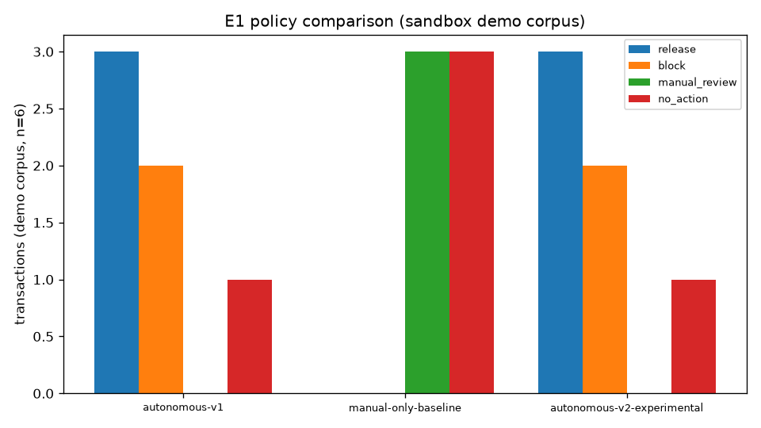

# Stage 11 Phase 11H — Research Evaluation Summary (run ac4b0b227f51453aa0590810ff6f2d99)

## Research question (spec §19)

> Can safety-gated autonomous recovery reduce recovery latency while preventing unsafe financial state changes compared with less constrained recovery strategies?

Answered ONLY on synthetic sandbox data (deterministic DEMO-S1..S6 corpus; no real financial transaction is performed).

## Metadata

- run_id: `ac4b0b227f51453aa0590810ff6f2d99`
- dataset_fingerprint: `12dddfdea660c9b1721f2a17c46a3087370fd0b4987aa52ca56bfaccb4adf427`
- policy versions: autonomous-v1, manual-only-baseline, autonomous-v2-experimental
- code_versions: `{"executor": "not-invoked", "model_version": "synthetic-v1", "policies": ["autonomous-v1", "manual-only-baseline", "autonomous-v2-experimental"], "rule_version": "1", "verifier": "not-invoked"}`
- seed: 42 — Recorded for convention only. The simulator and demo corpus are deterministic: the same seed + same corpus reproduce the same dataset_fingerprint and the same E1 decision metrics. The seed does not jitter anything in this experiment.
- git commit: `b4ecf6e39ba0e528d6bc7fbb2cffea5e260a4d10`
- timestamp (UTC): 2026-10-03T00:47:32Z
- api_url: http://127.0.0.1:8000 (environment: development)

## What was measured

- **E1 policy comparison** — the policy simulator over the demo corpus for all three policies, with ground-truth false_recovery / missed_recovery counts.
- **E2 safety-gate contribution** — see the honest-scope paragraph below.
- **E3 reliability under faults** — all 10 chaos scenarios with per-invariant outcomes.
- **E4 operational latency** — real recovery/risk/reconstruction latency snapshots from GET /metrics.

## E1 — policy comparison (n=6 demo transactions)

| policy | release | block | manual_review | no_action | gate_vetoes | false_recovery | missed_recovery | provider_calls_avoided | decision_latency_ms_avg |
|---|---|---|---|---|---|---|---|---|---|
| autonomous-v1 | 3 | 2 | 0 | 1 | 0 | 0 | 0 | 3 | 0.075 |
| manual-only-baseline | 0 | 0 | 3 | 3 | 0 | 0 | 3 | 6 | 0.008 |
| autonomous-v2-experimental | 3 | 2 | 0 | 1 | 0 | 0 | 0 | 3 | 0.016 |

dataset: source=demo transactions=['DEMO-S1', 'DEMO-S2', 'DEMO-S3', 'DEMO-S4', 'DEMO-S5', 'DEMO-S6'] fingerprint=`12dddfdea660c9b1721f2a17c46a3087370fd0b4987aa52ca56bfaccb4adf427`

## E2 — safety-gate contribution

HONEST SCOPE (E2): the safety gate is ALWAYS on in this system and cannot be switched off through the API, so no gate-off run exists. The reported comparison is (policy decisions) vs (policy decisions + measured gate vetoes): v1's gate_vetoes on the demo corpus plus the LATE_SETTLEMENT and CONCURRENT_RECOVERY chaos invariants. No gate-off counterfactual is fabricated anywhere in this experiment.

- v1 gate vetoes on the demo corpus: **0**

| chaos scenario | verdict | invariants held |
|---|---|---|
| CONCURRENT_RECOVERY | PASS | 5/5 |
| LATE_SETTLEMENT | PASS | 6/6 |

## E3 — reliability under faults (chaos)

| scenario | verdict | invariants held | note |
|---|---|---|---|
| GATEWAY_TIMEOUT | PASS | 4/4 |  |
| GATEWAY_ERROR | PASS | 4/4 |  |
| MERCHANT_TIMEOUT | PASS | 4/4 |  |
| LATE_SETTLEMENT | PASS | 6/6 |  |
| DUPLICATE_EVENT | PASS | 5/5 |  |
| OUT_OF_ORDER_EVENT | PASS | 5/5 |  |
| PROVIDER_TIMEOUT | PASS | 6/6 |  |
| PROVIDER_ERROR | PASS | 6/6 |  |
| CONCURRENT_RECOVERY | PASS | 5/5 |  |
| DB_FAILURE_SIMULATION | SKIP | 0/0 | covered by unit tests (tests/test_recovery_concurrency_hard.py IntegrityError race paths + executor failure-injection units); cannot be injected through the running API without monkeypatching a live session |

## E4 — operational latency (real /metrics snapshots)

| series | count | avg_ms | min_ms | max_ms |
|---|---|---|---|---|
| recovery_latency_ms | 30 | 193.5 | 26.2 | 345.2 |

Latencies are wall-clock observations of a live dev server and are **not** part of the reproducibility contract (only the dataset fingerprint and the E1 decision metrics are).

## Limitations

LIMITATIONS (all stated plainly):
- Synthetic demo corpus only: 6 deterministic transactions (DEMO-S1..S6).
  Small n; results are illustrative, not statistical.
- Sandbox provider only: every release is simulated; no real financial
  transaction is performed and no real-world claim is made.
- ML ablation is not API-switchable: the rules-only degradation path is
  covered by unit tests instead, not measured here as a live arm.
- The safety gate cannot be disabled via the API: E2 measures the gate's
  observed contribution (vetoes + chaos invariants), never a gate-off
  counterfactual.
- Latency columns are wall-clock observations of a live dev server and
  are explicitly NOT part of the reproducibility contract; only the
  dataset fingerprint and the E1 decision metrics are.
- GenAI provider availability may vary; this experiment measures the
  deterministic recovery/safety layer, not explanation quality.

