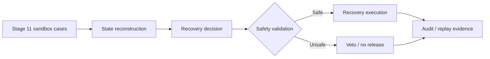

# Stage 11 — Recovery Safety & Replay Benchmark

> **Experiment:** `7c9f078b98b74608acc81cad4900371c`  
> **Evidence tier:** Sandbox benchmark  
> **Purpose:** Validate the recovery workflow's safety behavior, recovery outcome, and replayability before execution.

---

## 1. Executive Summary

Stage 11 is a focused sandbox benchmark of the recovery decision flow. The recorded benchmark contains **6 cases** and is preserved as an independent evaluation artifact.

The benchmark demonstrates:

- **3/3** recoverable cases successfully recovered
- **3 → 0** manual reviews
- **3,600 BDT** recorded recovery value
- **0 false releases**
- **E1 reproducibility:** consistent across **3 runs on 2 machines**

### At a glance

| Metric | Result |
|---|---:|
| Benchmark cases | **6** |
| Successful recoveries | **3 / 3** |
| Recovery rate on recoverable cases | **100%** |
| Recovery value | **3,600 BDT** |
| Manual reviews | **3 → 0** |
| False releases | **0** |
| Reproducibility | **3/3 runs × 2 machines** |

---

## 2. Outcome Visualization

### Recovery outcome

```text
Recoverable cases
Before / expected manual path   ████████████████████  3
Automated recovery              ████████████████████  3

Recovery rate                   ████████████████████ 100%
```

### Manual-review reduction

```text
Before                         ████████████████████  3
After                          ░░░░░░░░░░░░░░░░░░░░  0

Reduction: 3 cases
Reduction rate: 100%
```

### Safety result

```text
False releases                 ░░░░░░░░░░░░░░░░░░░░  0
Unsafe releases observed       ░░░░░░░░░░░░░░░░░░░░  0
```

> The visual bars above are proportional summaries of the recorded Stage 11 counts; they are not additional measurements.

---

## 3. Benchmark Flow



The benchmark is designed to validate the recovery path while preserving an auditable result.

---

## 4. Results

### Core benchmark results

| Dimension | Observed result | Interpretation |
|---|---:|---|
| Cases in benchmark | 6 | Small controlled sandbox |
| Recoveries | 3/3 | All eligible recovery cases succeeded |
| Recovery value | 3,600 BDT | Recorded benchmark outcome |
| Manual reviews | 3 → 0 | Manual intervention eliminated for the benchmark's recoverable cases |
| False releases | 0 | No incorrect release observed |
| Reproducibility | 3/3 runs on 2 machines | Result reproduced consistently |

### Important scope note

The **3,600 BDT** figure is a **recorded sandbox benchmark outcome**, not evidence of realized production revenue or savings.

Likewise, the **100% recovery rate** applies to the benchmark's recoverable cases. It should not be generalized to the full production population.

---

## 5. Reproducibility

The Stage 11 E1 result was verified across:

- **3 independent runs**
- **2 machines**
- consistent benchmark outcome

```text
Run 1   ████████████████████  Pass
Run 2   ████████████████████  Pass
Run 3   ████████████████████  Pass

Machines tested: 2
Runs reproduced: 3 / 3
```

This supports the claim that the sandbox result was reproducible under the recorded benchmark setup.

---

## 6. Safety Interpretation

The strongest Stage 11 safety result is the combination of:

1. **State reconstruction before recovery**
2. **Safety validation before release**
3. **Zero false releases in the benchmark**
4. **Replayable/reproducible evaluation evidence**

The benchmark therefore provides evidence that the recovery flow can automate eligible cases while preserving a safety boundary before execution.

---

## 7. Relationship to the Full Evaluation

Stage 11 is a **sandbox benchmark**, not the primary full-dataset business-impact evaluation.

The broader evaluation uses separate evidence tiers:

| Evidence tier | Scope | Role |
|---|---|---|
| **Tier A** | 1,142 recorded cases | Ground-truth business-impact evaluation |
| **Tier B** | 1,142 live re-simulated cases | Current-engine execution-consistency check |
| **Tier C / Stage 11** | 6 sandbox cases | Controlled safety/reproducibility benchmark |

Keeping these tiers separate prevents sandbox results from being presented as population-level production outcomes.

---

## 8. Key Takeaways

### What Stage 11 demonstrates

- **Automation:** 3 recoverable cases completed without manual review.
- **Safety:** 0 false releases in the benchmark.
- **Financial outcome:** 3,600 BDT recorded recovery value.
- **Reproducibility:** the benchmark outcome reproduced across 3 runs on 2 machines.
- **Auditability:** the experiment is preserved as a standalone artifact and can be reviewed independently.

### What Stage 11 does not prove

- It does **not** establish a production-wide 100% recovery rate.
- It does **not** establish 3,600 BDT of realized production savings.
- It does **not** replace the 1,142-case full-dataset evaluation.
- It does **not** by itself establish long-term customer or financial outcomes.

---

## 9. Artifact

Experiment ID:

```text
7c9f078b98b74608acc81cad4900371c
```

Recommended repository artifacts:

```text
reports/stage11/
├── configs/
│   └── experiment-7c9f078b98b74608acc81cad4900371c.json
├── experiments/
│   ├── experiment-7c9f078b98b74608acc81cad4900371c.json
│   ├── experiment-7c9f078b98b74608acc81cad4900371c_e1.png
│   └── experiment-7c9f078b98b74608acc81cad4900371c_summary.md
└── metrics/
    └── summary-7c9f078b98b74608acc81cad4900371c.csv
```

---

## 10. Reproducibility Note

This document summarizes the recorded Stage 11 evidence without introducing new experimental results. For the exact configuration, raw metrics, and original experiment output, use the repository artifacts listed above.
